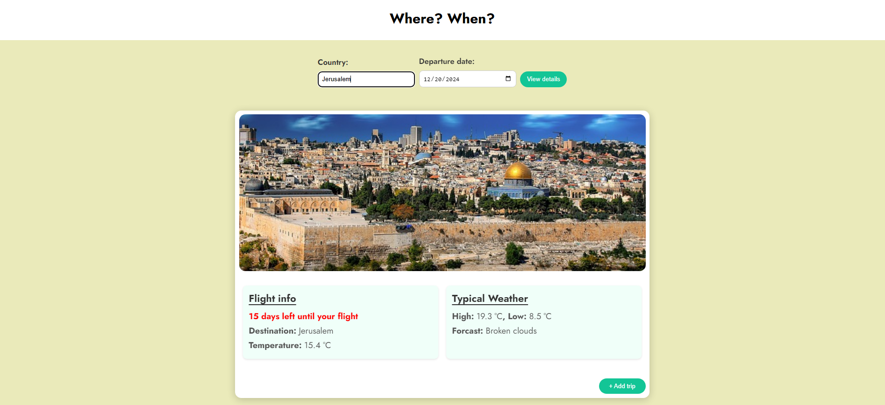
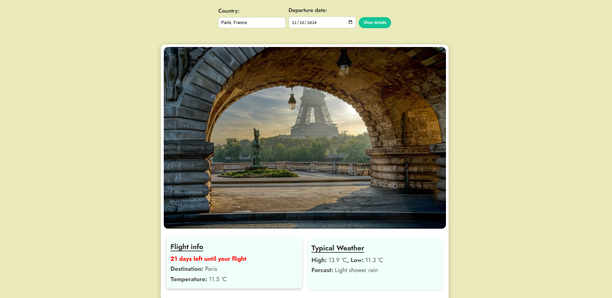
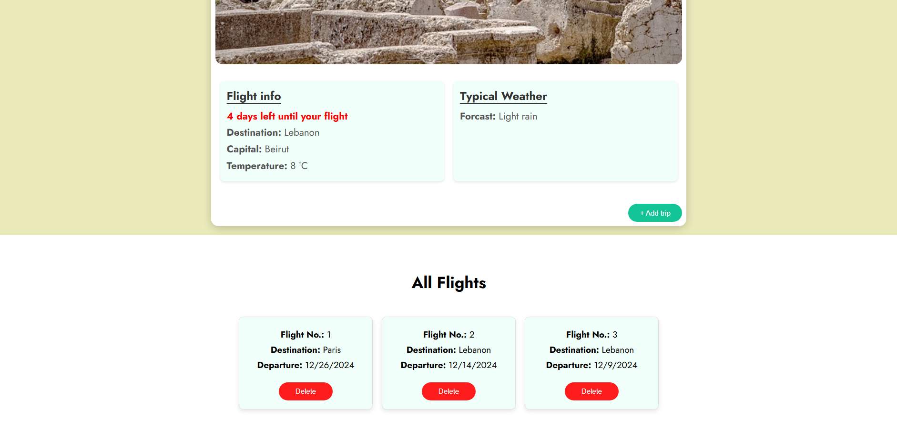

# TravelApp

## Description
TravelApp is a web application designed to assist you in discovering new destinations and organizing your trips effectively. It includes features that enable you to check the weather at your chosen locations, making it an ideal tool for travel lovers.

## Table of Contents

- [Description](#description)
- [Table of Contents](#table-of-contents)
- [Installation](#installation)
- [Usage](#usage)
- [Features](#features)
- [Contributing](#contributing)
- [License](#license)

## Installation

- We use the npm package manager, so make sure to install the necessary dependencies.
```bash
npm install
```

- To test the application, you will need to run two terminal windows and execute a series of commands:

  1- Open the first terminal and run the following to build the development environment:
    ```bash
    npm run build-dev
    ```
  2-  Open the second terminal and run the following to build the production environment:
    ```bash
    npm run build-prod
    ```
  3- Once the build process has finished, start the server by running:
  ```bash
    npm start
    ```
  4- You can enter any city, country, or city and country together, such as "Paris, France".
  
- As an additional step, countrylayer API was added as it is one of the suggestions included in the project to add the capital of the country if it exists:
  ```bash
     COUNTRYLAYER = dcce2f14c106cb39dcf95d923f033c84
  ```
- Node.js version: v18.16.0
- Screenshots to illustrate how the app works properly:




## Usage

Simply enter the country/city you wish to travel to, along with your departure date, and click "View details" to see flight information and the expected weather, then if you decide to travel you can add the flight to your travel list.

## Features
- Weather Information: Check the typical weather for any country you intend to visit.
- Trip Planning: Simply enter your desired country and travel dates to view relevant flight and weather information.
- Responsive Design: Fully functional on mobile and desktop devices.

## Contributing

1. Fork the repository.
2. Create a new branch.
3. Fix/Add features.
4. Commit the changes.
5. Push to the branch.
6. Open/Create pull Request.

## License

[Udacity](https://learn.udacity.com/nanodegrees/nd0011-palestine)
